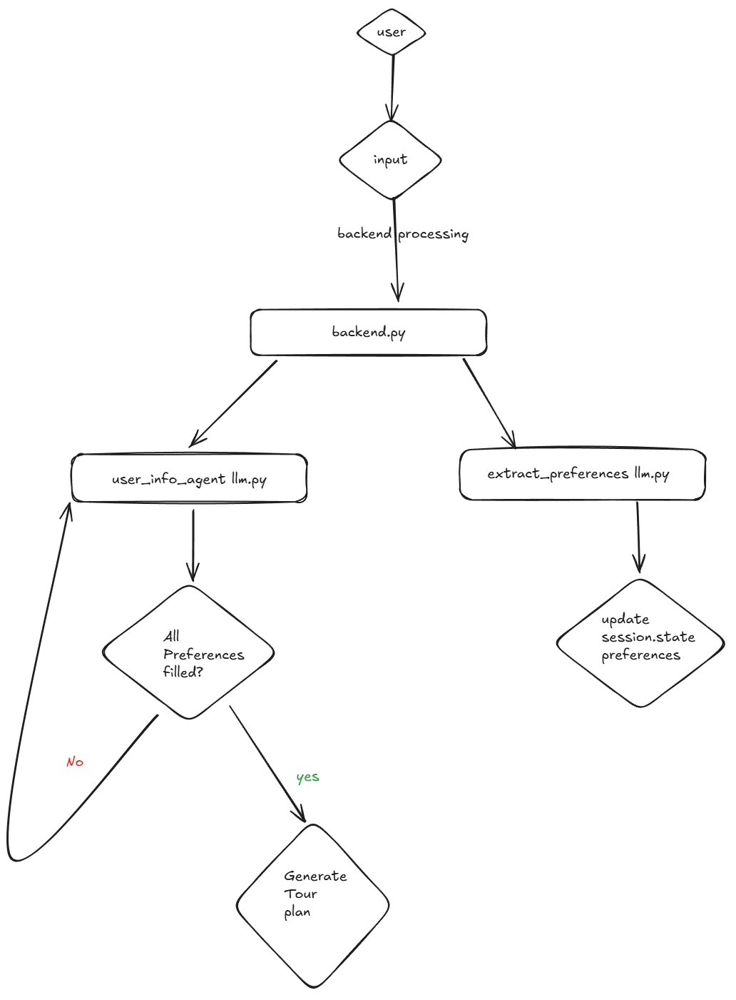

# One-Day Tour Planning Assistant

This project implements an intelligent one-day tour planning assistant that dynamically adjusts to user preferences through a chat-based interface. It personalizes itinerary suggestions based on user inputs, remembers preferences across conversations, and adapts seamlessly to evolving requirements.

## Features
- Personalized itinerary suggestions tailored to user preferences.
- Memory management using **LLM-generated triplets** stored in a **Neo4j graph database**.
- Real-time dynamic updates to the itinerary based on user feedback.
- Supports at least three distinct user personas with unique preferences.

## How to Run

### 1. Install Dependencies
Ensure you have Python installed. Create a virtual environment and install the required dependencies:

```bash
pip install -r requirements.txt
```

### 2. Obtain Groq key and Configure Neo4j Credentials
Create a Groq key and save it in a .env file in the root directory.Provide your Neo4j database credentials (URI, username, and password) in the .env file. The file should look like this:

```bash
GROQ_KEY=your_groq_key_here
NEO4J_PASSWORD=your_neo4j_password_here
NEO4J_USER=your_neo4j_username_here
NEO4J_URI=neo4j_uri
```
### 3. Lauch the Application
Run the following command to start the application:

```bash
streamlit run app.py
```

**Implementation Approach**

* **Graph Database:**
    * Utilize Neo4j to store and manage personas, traits, and user preferences.
    * Model personas with their associated traits (preferred activities, interests) as nodes and relationships.
    * Store user preferences (city, time_range, budget, interests, starting_point) as nodes and relationships.

* **LLM Integration:**
    * Employ an LLM (e.g., llama3-8b-8192) for:
        * **User Interaction:** Handling user messages, providing information, and guiding the conversation.
        * **Preference Extraction:** Extracting user preferences from conversation history, considering persona traits.

* **Workflow:**
    * **Initialize Personas:** Create persona nodes and their associated trait nodes in the graph.
    * **User Interaction:**
        * Process user messages using the LLM to maintain conversation flow.
        * Extract user preferences from the conversation history.
        * Store user preferences in the graph.
    * **Personalized Recommendations:** 
        * Use the graph to retrieve relevant information (e.g., persona preferences, user preferences) for personalized recommendations.
**Implementation Workflow**

